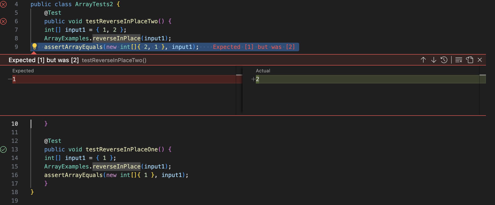

# Part 1
Given this method:
```
static void reverseInPlace(int[] arr) {
    for(int i = 0; i < arr.length; i += 1) {
      arr[i] = arr[arr.length - i - 1];
    }
  }
```
Then, given these two tests:
```
public class ArrayTests2 {
	@Test 
	public void testReverseInPlaceTwo() {
    int[] input1 = { 1, 2 };
    ArrayExamples.reverseInPlace(input1);
    assertArrayEquals(new int[]{ 2, 1 }, input1);
	}

    @Test 
	public void testReverseInPlaceOne() {
    int[] input1 = { 1 };
    ArrayExamples.reverseInPlace(input1);
    assertArrayEquals(new int[]{ 1 }, input1);
	}
}
```
The first test fails, while the second test doesn't:  


And given this the orginal code:
```
static void reverseInPlace(int[] arr) {
    for(int i = 0; i < arr.length; i += 1) {
      arr[i] = arr[arr.length - i - 1];
    }
  }
```
Changed it to:
```
static void reverseInPlaceNew(int[] arr) {
    for(int i = 0; i < arr.length / 2; i += 1) {
      int holder = arr[i];
      arr[i] = arr[arr.length - i - 1];
      arr[arr.length - i - 1] = holder;
    }
  }
```
This now stops the previous code from creating a mirrored array, but instead a properly reversed one.  
Since the previous wrote over the first half with the second half, then reassigned the new first half back to the second half, which   effectively mirrored the array, as opposed to reversing it. Whereas the new method only iterates halfway through the array, and properly swaps each of the first half of the elements with those in the last half, which effectively reverses the array.  

# Part 2
After give ChatGPT the prompt: "what are all the ways to use find"  
It gave me: "The find command in Unix/Linux is a powerful tool used to search for files and directories within a directory hierarchy. It provides many options and arguments to customize and refine the search criteria. Here are some common and advanced ways to use the find command:

Basic Usage
Find all files and directories starting from a specified path:
```
	find /path/to/search
```
Common Options
Search by name:

Exact match:
```
	find /path/to/search -name "filename"
```
Case-insensitive match:
```
	find /path/to/search -iname "filename"
```
Pattern match (using wildcards):
```
	find /path/to/search -name "*.txt"
```
Search by type:

Files:
```
	find /path/to/search -type f
```
Directories:
```
	find /path/to/search -type d
```
Search by size:

Files larger than 1MB:
```
	find /path/to/search -size +1M
```
Files smaller than 1KB:
```
	find /path/to/search -size -1k
```
Search by modification time:

Modified in the last 7 days:
```
	find /path/to/search -mtime -7
```
Modified more than 30 days ago:
```
	find /path/to/search -mtime +30
```
Search by file permissions:

Files with exact permission 755:
```
	find /path/to/search -perm 755
```
Files writable by others:
```
	find /path/to/search -perm -o=w
```

So I used:
```
find ./technical -name "final.txt" > find-results.txt
cat find-results.txt
```
Which gave all files with the name "final.txt":
```
./technical/government/Env_Prot_Agen/final.txt
```
and:
```
find ./technical -name "commission_report.txt" > find-results.txt
cat find-results.txt
```
Which gaveall files with the name "commission_report.txt":
```
./technical/government/About_LSC/commission_report.txt
```
and:
```
find ./technical -type f > find-results.txt
cat find-results.txt
```
Which gave a very long list of all files in the technical directory:
```
...
./technical/911report/chapter-12.txt
./technical/911report/chapter-10.txt
./technical/911report/chapter-11.txt
```
and:
```
find ./technical -type d > find-results.txt
cat find-results.txt
```
Which gave a list of all directories in technical:
```
./technical
./technical/government
./technical/government/About_LSC
./technical/government/Env_Prot_Agen
./technical/government/Alcohol_Problems
./technical/government/Gen_Account_Office
./technical/government/Post_Rate_Comm
./technical/government/Media
./technical/plos
./technical/biomed
./technical/911report
```
and:
```
find ./technical -size -1k > find-results.txt
cat find-results.txt
```
Which gave all files and directories with size less than 1KB:
```
./technical
./technical/government
./technical/government/About_LSC
./technical/government/Env_Prot_Agen
./technical/government/Alcohol_Problems
./technical/government/Post_Rate_Comm
./technical/plos/pmed.0020191.txt
./technical/plos/pmed.0020226.txt
./technical/911report
```
and:
```
find ./technical -size +150k > find-results.txt
cat find-results.txt
```
Which gave all files and directories with size larger than 150KB:
```
./technical/government/About_LSC/commission_report.txt
./technical/government/Env_Prot_Agen/multi102902.txt
./technical/government/Env_Prot_Agen/bill.txt
./technical/government/Env_Prot_Agen/tech_adden.txt
./technical/government/Gen_Account_Office/GovernmentAuditingStandards_yb2002ed.txt
./technical/government/Gen_Account_Office/Statements_Feb28-1997_volume.txt
./technical/government/Gen_Account_Office/pe1019.txt
./technical/government/Gen_Account_Office/d01591sp.txt
./technical/911report/chapter-13.4.txt
./technical/911report/chapter-13.5.txt
./technical/911report/chapter-3.txt
```
and:
```
find ./technical -mtime -23 > find-results.txt
cat find-results.txt
```
Which gave all files modified in the last 23 days:
```
...
./technical/911report/chapter-12.txt
./technical/911report/chapter-10.txt
./technical/911report/chapter-11.txt
```
and:
```
find ./technical -mtime -22 > find-results.txt
cat find-results.txt
```
Which gave all files modified in the last 22 days:
```
```
Since the last day all the files were "modified" was when I cloned them onto my computer 23 days ago.

